# Nick Blair

Backend and data engineer working in fintech, based in Guildford, UK. I've spent my career on both sides of the stack — building backend services and data systems — and I care a lot about doing engineering well, whatever the layer.

<p align="left">
  <picture>
    <source media="(prefers-color-scheme: dark)" srcset="https://raw.githubusercontent.com/nsantiagoblair/nsantiagoblair/output/github-contribution-grid-snake-dark.svg" />
    <source media="(prefers-color-scheme: light)" srcset="https://raw.githubusercontent.com/nsantiagoblair/nsantiagoblair/output/github-contribution-grid-snake.svg" />
    
  </picture>
</p>

## What I Do

- Design and build backend services and data systems, mostly on AWS
- Work with large-scale batch and streaming data using PySpark and Iceberg
- Wrangle data across SQL in all its flavours, from transactional databases to the data warehouse
- Define infrastructure as code with Terraform
- Lean heavily on AI in my day-to-day workflow, and enjoy pushing to see how far it can take an engineer

## Tech Stack


```bash
Backend:    Go, TypeScript, PHP
Data:       Python, PySpark, Iceberg
Databases:  SQL (Postgres, MySQL, Redshift, Athena, ...)
Cloud:      AWS
Infra:      Terraform
```

## Stats

<p align="left">
  
  
</p>

## Contact

[Email](mailto:nsantiagoblair@gmail.com) · [LinkedIn](https://uk.linkedin.com/in/nick-santiago-blair-21baa45a)
