# 👋 Hey, I'm Nick

I'm a backend and data engineer working in fintech, based in Guildford, UK. I've spent my career on both sides of the stack — building backend services and data systems — and I care a lot about doing engineering well, whatever the layer.


<picture>
  <source media="(prefers-color-scheme: dark)" srcset="https://raw.githubusercontent.com/nsantiagoblair/nsantiagoblair/output/github-contribution-grid-snake-dark.svg" />
  <source media="(prefers-color-scheme: light)" srcset="https://raw.githubusercontent.com/nsantiagoblair/nsantiagoblair/output/github-contribution-grid-snake.svg" />
  
</picture>

## 💼 What I Do

- 🧱 Design and build backend services and data systems, mostly on AWS
- ⚡ Work with large-scale batch and streaming data using PySpark and Iceberg
- 🗄️ Wrangle data across SQL in all its flavours, from transactional databases to the data warehouse
- 🛠️ Define infrastructure as code with Terraform
- 🤖 Lean heavily on AI in my day-to-day workflow, and enjoy pushing to see how far it can take an engineer

## ⚙️ Tech Stack


```bash
Backend:    Go, TypeScript, PHP
Data:       Python, PySpark, Iceberg
Databases:  SQL (Postgres, MySQL, Redshift, Athena, ...)
Cloud:      AWS
Infra:      Terraform
```

## 📊 GitHub Stats

<p align="left">
  <picture>
    <source media="(prefers-color-scheme: dark)" srcset="./profile/stats-dark.svg" />
    <source media="(prefers-color-scheme: light)" srcset="./profile/stats-light.svg" />
    
  </picture>
  <picture>
    <source media="(prefers-color-scheme: dark)" srcset="./profile/top-langs-dark.svg" />
    <source media="(prefers-color-scheme: light)" srcset="./profile/top-langs-light.svg" />
    
  </picture>
  <picture>
    <source media="(prefers-color-scheme: dark)" srcset="https://streak-stats.demolab.com/?user=nsantiagoblair&theme=github-dark-blue" />
    <source media="(prefers-color-scheme: light)" srcset="https://streak-stats.demolab.com/?user=nsantiagoblair" />
    
  </picture>
</p>

Stats and top languages cards are regenerated daily by [`.github/workflows/readme-stats.yml`](.github/workflows/readme-stats.yml) and committed as static SVGs, so they don't depend on a live third-party API call on every profile view. They currently only count public repos — see the workflow comments if you want to add a PAT for private contribution counts.

## 📫 Contact
- 📧 Email: [nsantiagoblair@gmail.com](mailto:nsantiagoblair@gmail.com)
- 💼 LinkedIn: [Nick Santiago-Blair](https://uk.linkedin.com/in/nick-santiago-blair-21baa45a)
